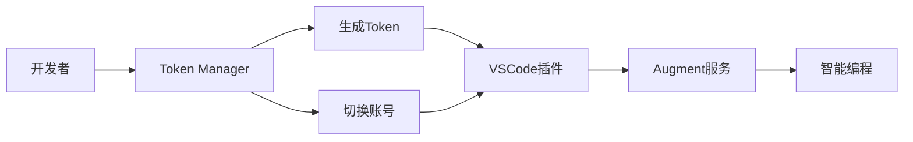

# Augment Token Manager

🚀 **专为 Augment VSCode 插件设计的智能Token管理平台**

一个现代化的Web平台，让你轻松管理Augment访问令牌，实现多账号无感切换，提升开发效率。 该平台需要特点的vscode插件使用

## ✨ 核心特性

### 🔐 智能身份验证
- **多平台登录支持** - GitHub、LinuxDo 一键登录
- **安全可靠** - 基于OAuth2.0标准，保障账户安全
- **统一身份管理** - 多平台账号自动关联

### 🎯 Token生命周期管理
- **一键生成** - 快速创建Augment访问令牌
- **实时状态** - 查看Token使用状态和有效期
- **批量操作** - 支持批量管理多个Token
- **安全销毁** - 一键安全删除不需要的Token

### 🔄 无感账号切换
- **智能识别** - 自动识别当前开发环境
- **无缝切换** - 配合VSCode插件实现账号无感切换
- **状态同步** - 实时同步Token使用状态

### 👥 协作与分享
- **Token转让** - 安全地将Token转让给团队成员
- **权限管理** - 精细化的访问权限控制
- **使用追踪** - 详细的Token使用记录

## 🚀 快速开始

### 1. 访问平台
打开 [Augment Token Manager](https://augment.daiju.live) 

### 2. 登录账户
选择你喜欢的方式登录：
- 🐙 GitHub账户登录
- 🐧 LinuxDo账户登录

### 3. 创建Token
1. 点击 "添加Token" 按钮
2. 输入你的Augment租户URL
3. 系统自动生成专属Token
4. 复制Token到剪贴板

### 4. 配置VSCode插件
1. 在VSCode中安装Augment插件
2. 打开插件设置
3. 粘贴你的Token
4. 享受智能编程体验！

## 🔧 与Augment VSCode插件配合使用

### 无感切换工作流

### 典型使用场景

#### 🏢 企业开发团队
- **项目隔离** - 不同项目使用不同Token
- **权限分级** - 根据角色分配不同权限的Token
- **成本控制** - 精确追踪每个Token的使用情况

#### 👨‍💻 个人开发者
- **多账号管理** - 工作账号和个人账号分离
- **项目切换** - 快速在不同项目间切换
- **使用优化** - 监控Token使用情况，优化开发效率

## 📊 功能亮点

### 🎛️ 直观的管理界面
- **现代化设计** - 简洁美观的用户界面
- **响应式布局** - 完美适配桌面和移动设备
- **实时更新** - 数据实时同步，无需手动刷新

### 📈 详细的使用统计
- **使用时长** - 精确记录Token使用时间
- **调用次数** - 统计API调用频率
- **效率分析** - 帮助优化开发工作流

### 🔒 企业级安全
- **数据加密** - 所有敏感数据均加密存储
- **访问控制** - 严格的权限验证机制
- **审计日志** - 完整的操作记录追踪

## 📝 使用指南

### Token管理最佳实践

1. **定期轮换** - 建议定期更新Token以保障安全
2. **按需创建** - 根据实际需求创建Token，避免浪费
3. **及时清理** - 删除不再使用的Token
4. **权限最小化** - 只分配必要的权限

### 故障排除

#### Token无法使用？
- 检查Token是否已过期
- 确认租户URL是否正确
- 验证网络连接是否正常

#### 无法登录？
- 确认使用的是支持的登录方式
- 检查浏览器是否禁用了第三方Cookie
- 尝试清除浏览器缓存

## 💰 赞助支持

如果这个项目对你有帮助，欢迎赞助支持开发：

  
  
<strong>微信扫码赞助</strong>

## 👥 交流群组

加入我们的QQ群，与其他开发者交流使用心得：

**QQ群号：1014952167**

## 🤝 贡献指南

我们欢迎社区贡献！如果你有好的想法或发现了问题：

1. 🐛 **报告Bug** - 在Issues中详细描述问题
2. 💡 **功能建议** - 分享你的创意想法
3. 📖 **文档改进** - 帮助完善文档内容

---

**让智能编程更简单，让开发效率更高效** 🚀

[开始使用](https://augment.daiju.live)

